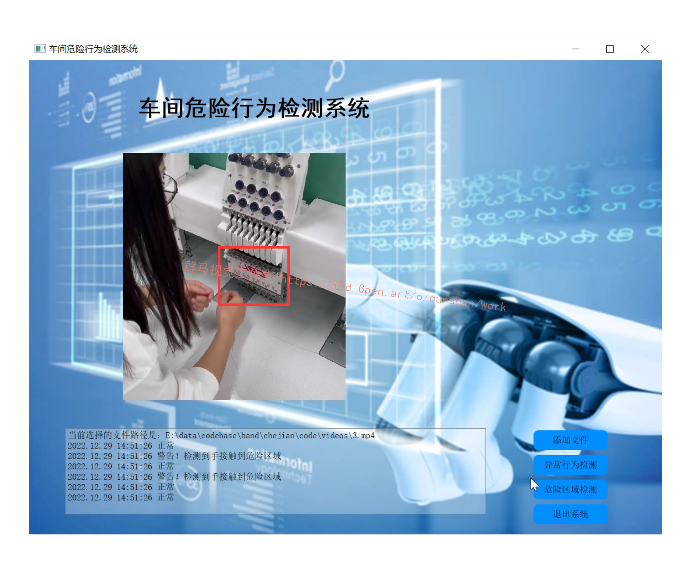
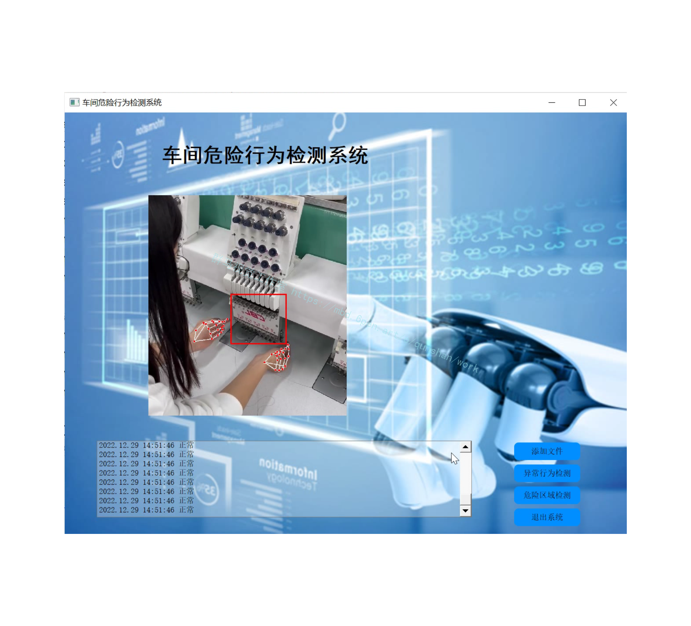
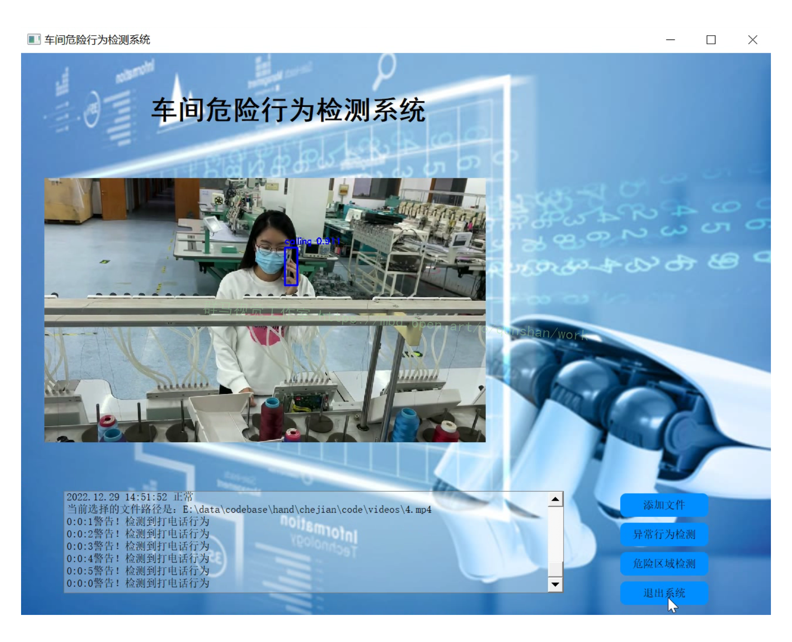
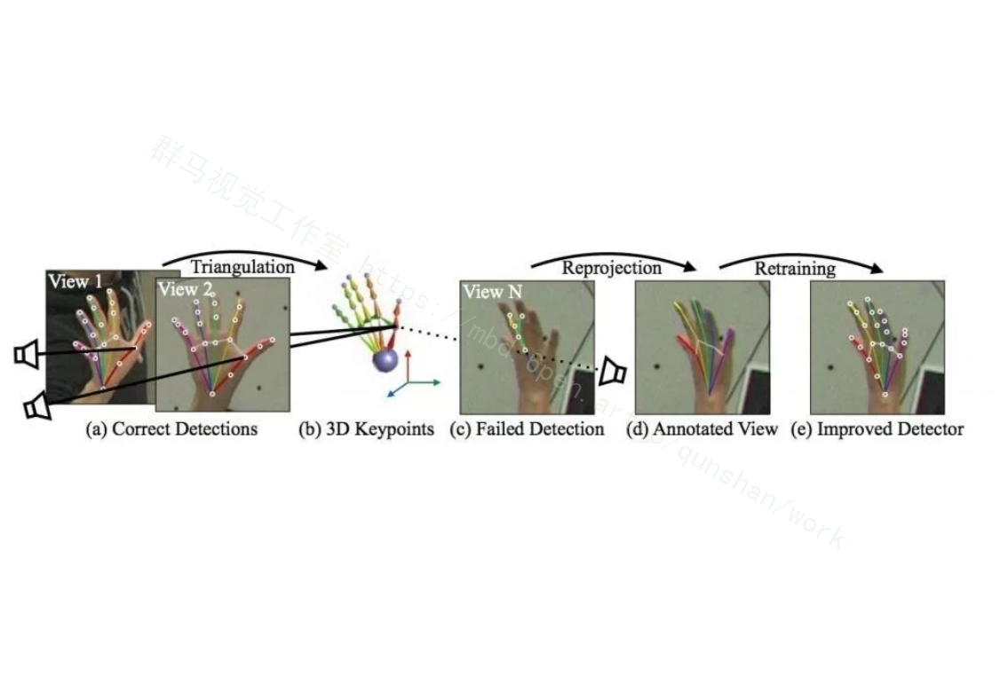
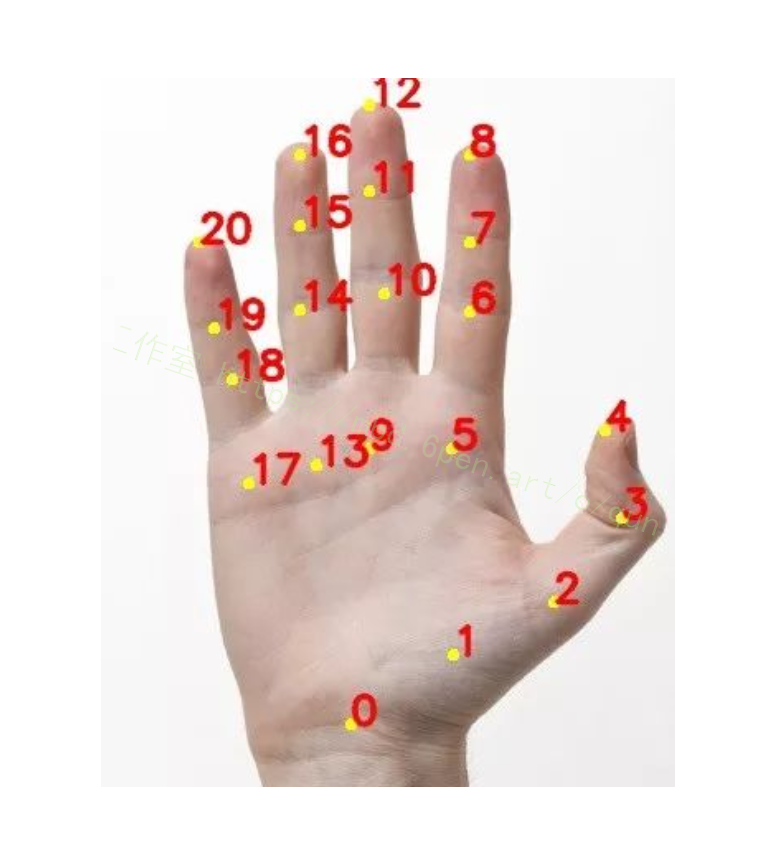
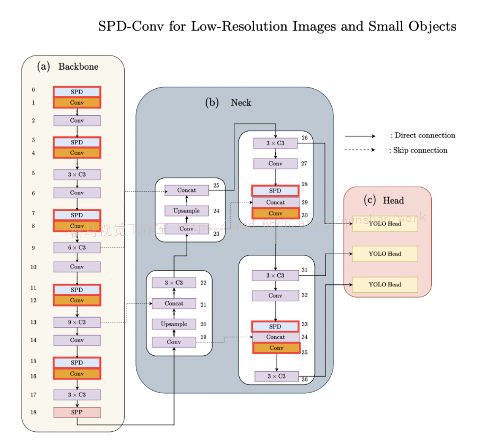
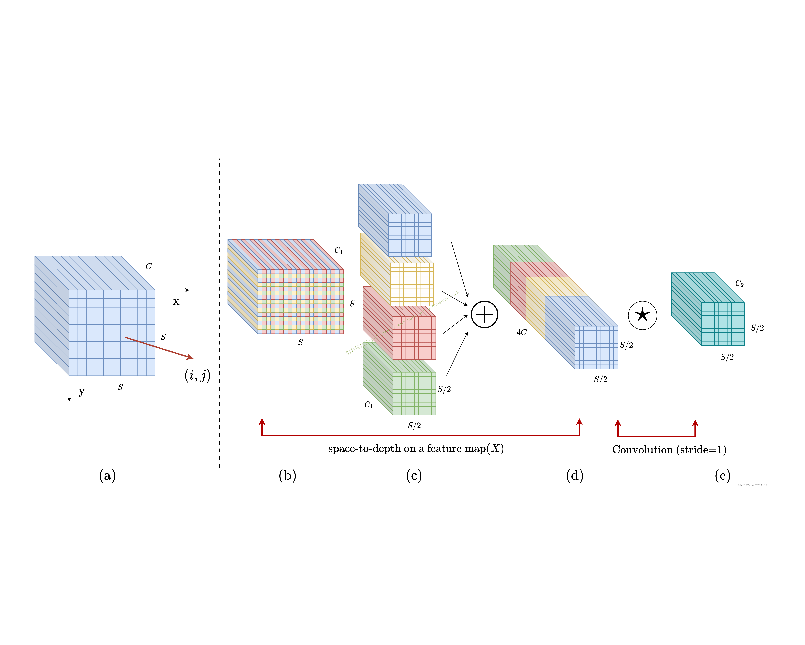
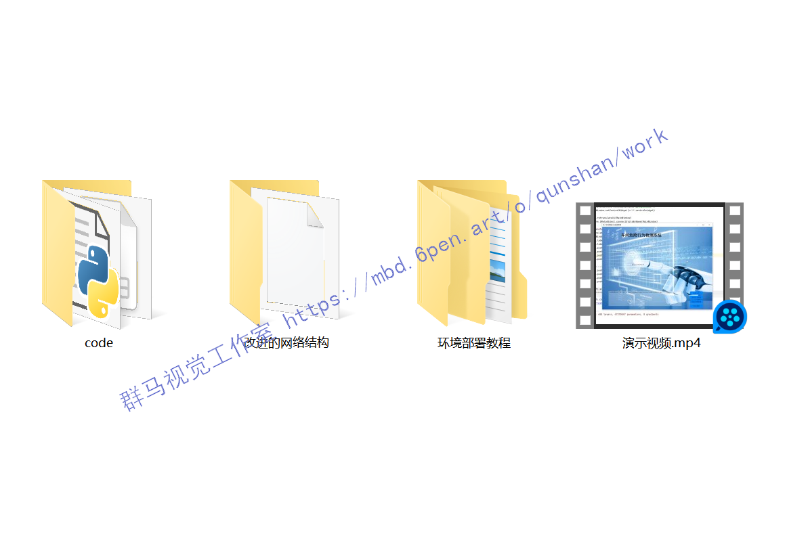

# 1.研究背景
在产业智能化升级的趋势下,越来越多的企业正试图通过机器人和人工智能等技术,打造智慧工厂。在智慧工厂中,工人的活动范围较广且环境复杂,车间内严禁使用明火、抽烟、打电话等易造成事故的行为发生。如果采用传统的人工分析视频的方法来监控人员行为,耗时费力且容易出现疏漏,因此迫切需要研究面向智慧工厂的车间人员行为识别方法,从而实现智能化的安防管控。

# 2.图片演示






# 3.视频演示
[基于改进YOLOv7和Opencv的车间危险行为检测系统（源码＆教程）_哔哩哔哩_bilibili](https://www.bilibili.com/video/BV14e4y157dG/?vd_source=bc9aec86d164b67a7004b996143742dc)

# 4.国内外研究现状
早期对行为识别的研究是将运动人体的轮廓、运动方向等作为特征信息进行识别,主要包括时空兴趣点法和运动轨迹法等,改进的密集轨迹(ImprovedDense 'Trajectories, IDT)算法是其中最经典的模型。随着人体三维数据采集技术的发展,行为识别可大致分为两类。一类是基于骨骼关键点的行为识别,利用视频帧之间关键点的变化描述人体行为。Yan等通过骨骼序列构建时空图,提出了基于骨架的动作识别时空图卷积网络(Spatial Temporal Graph ConvolutionalNetworks , ST-GCN)。Plizzari 等提出的时空转换网络( Spatial-Temporal 'Transformer Network , ST-TR)针对ST-GCN只能捕捉局部特征这一不足进行了改进,提出了空间自注意力模块( Spatial Self-Attention , SSA)和时间自注意力模块(Temporal Self-Attention , TSA)来捕捉特征。另一类是基于RGB的深度学习方法,根据要处理的输入任务可分为基于视频和基于图像的行为识别。基于视频的行为识别方法是给定剪辑好的视频行为片段,输出视频级的行为类别,主流方法有TSN( Temporal Segment Networks )、TSM ( 'Temporal ShiftModule) 、SlowFast 、TimeSformer ( Time-Space Trans-former)等。TSN属于双流法( 'Two-Stream),将特征提取分为2路,一路分支使用RGB视频帧提取空间特征,另一路对时间提取光流特征。Feichtenhofer等提出的SlowFast与双流法思路类似, Slow分支用于学习空间语义信息, Fast分支学习运动信息。Facebook提出的 TimeSformer”是一种无卷积的视频分类方法，基于Transformer模型的自注意力机制,对一系列视频帧提取时空序列并单独应用时间注意力和空间注意力进行学习。基于图像的行为识别方法分为以残差网络(ResNet)为代表的行为分类和以YOLO( You Only LookOnce)为代表的行为检测。ResNet输出的是图像级的分类结果,YOLO是对输入的视频帧中的每个目标进行定位和类别检测,是一种端到端的训练和推断方法。

车间行为多为人和物的交互,基于骨骼关键点的行为识别方法仅输入关键点的坐标信息,丢弃了关键的物体和语义信息,难以区分相似动作(如打电话和摸耳朵)。基于RGB的深度学习方法中,多数方法对输入数据的处理要求严格,为保证充分的模型协而资八量的数据,对计算设备的要求高,推理速度也有所欠缺。其中,基于图像的行为识别万法由于米用AP3TO的网络结构,推理速度较快,模型体积较小且谷易部者。上述两类行为识别方法都是基于可见光的视频输入，可见光图像虽然含有清晰丰富的纹理细节,但在车间某些昏暗或隐蔽的环境下观测双果差,谷易逆漏目标。

相反红外图像能够根据辐射差异将目标与育景区分开,特征更为突出。常用的监控视频包括红外和可见光2种,仅使用红外识别的万法也仔任分个权低和细节缺失的问题,因此考虑将可见光图像和红外图像进行融合,弥补单一传感器成像的不足,从而提高识别精度。融合方式包括像素级融合、特级棚合大界级融合。像素级融合和特征级融合“在对算力和时间的需求上都比决策级融合要高,而决策级融合能够吸取可见光和红外的互补信息达到全局最优。

为了有效地规范车间人员的行为,针对传统监控方式耗时费力和单一数据源易受环境影响识别效果差的问题,本项目提出一种改进YOLOv7网络;提出了决策级融合算法,能够减少漏检的情况,提高行为识别的效果和精度。

# 5.手部骨骼点检测
[参考该博客关于OpenCV 骨骼点检测的博文](https://mbd.pub/o/bread/Y52am55w)，展示了OpenCV作为DNN推断工具的简单用法。
昨日Satya Mallick又发表了使用OpenCV调用OpenPose工程中的手部关键点检测（hand pose estimation）模型的文章，对于想要使用手部关键点检测做手势识别、手语识别、抽烟检测等工程开发的朋友来说这是一个非常简单的上手教程。

#### 算法思想
作者使用的算法模型是CMU Perceptual Computing Lab开源的集合人体、人脸、手部关键点检测的开源库OpenPose，其中手部关键点检测（Hand Keypoint detector）算法来自CVPR2017的论文《Hand Keypoint Detection in Single Images using Multiview Bootstrapping》。
人手在3D空间由于视角不同、灵活的精细动作等原因，较难得到精确标注的数据集。在该论文中，作者提出了一种称之为Multiview Bootstrapping的手部关键点检测迭代改进算法，实现了具有较高精度的检测算法。     


如上图所示，作者提出首先使用少量标注的含有人手关键点的数据集训练Convolutional Pose Machines神经网络，使用31个不同视角的高清摄像头拍摄人手，用上述检测模型初步检测关键点，将这些关键点根据摄像机的位姿构建三角（triangulation），得到关键点的3D位置，再将计算得到的3D点位置重投影到每一幅不同视角的2D图像，再使用这些2D图像和关键点标注训练检测模型网络，经过几次迭代，即可以得到较为精确的手部关键点检测模型。
原论文中提出的模型可生成22个关键点，其中21个点是人手部的，第22个点代表着背景。下图展示了人手部的21个关键点位置。


# 6.改进YOLOv7
#### SPD模块
卷积神经网络 (CNN) 在许多计算机视觉任务（例如图像分类和对象检测）中取得了巨大成功。然而，它们的性能在图像分辨率低或物体很小的更艰巨的任务中迅速下降。[参考该博客指出，现有 CNN 架构中存在缺陷但常见的设计](https://afdian.net/item?plan_id=dd48482a874b11eda0f452540025c377)，即使用跨步卷积和/或池化层，这会导致细粒度信息的丢失和对不太有效的特征表示的学习. 为此，我们提出了一个名为SPD-Conv的新 CNN 构建块来代替每个跨步卷积层和每个池化层（因此完全消除了它们）。SPD-Conv 由空间到深度(SPD) 层后跟非跨步卷积 (Conv) 层，可以应用于大多数（如果不是全部）CNN 架构。我们在两个最具代表性的计算机视觉任务下解释了这种新设计：对象检测和图像分类。然后，我们通过将 SPD-Conv 应用于 YOLOv7 和 ResNet 来创建新的 CNN 架构，并通过经验证明我们的方法明显优于最先进的深度学习模型，尤其是在具有低分辨率图像和小物体的更艰巨任务上。


#### 模块结构


# 7.代码实现
./models/common.py文件增加以下模块
```
class space_to_depth(nn.Module):
    # Changing the dimension of the Tensor
    def __init__(self, dimension=1):
        super().__init__()
        self.d = dimension

    def forward(self, x):
         return torch.cat([x[..., ::2, ::2], x[..., 1::2, ::2], x[..., ::2, 1::2], x[..., 1::2, 1::2]], 1)


```

# 8.系统整合
下图[完整源码＆环境部署视频教程＆自定义UI界面](https://s.xiaocichang.com/s/c20a20)

参考博客[《基于改进YOLOv7和Opencv的车间危险行为检测系统（源码＆教程）》](https://mbd.pub/o/qunma/work)

# 9.参考文献
***
[1][任敏](https://s.wanfangdata.com.cn/paper?q=%E4%BD%9C%E8%80%85:%22%E4%BB%BB%E6%95%8F%22).[智数合一，智慧工厂的四大典型应用场景](https://d.wanfangdata.com.cn/periodical/zgxxh202101019)[J].[中国信息化](https://sns.wanfangdata.com.cn/perio/zgxxh).2021,(1).47-49.

[2][孙君顶](https://s.wanfangdata.com.cn/paper?q=%E4%BD%9C%E8%80%85:%22%E5%AD%99%E5%90%9B%E9%A1%B6%22),[李海华](https://s.wanfangdata.com.cn/paper?q=%E4%BD%9C%E8%80%85:%22%E6%9D%8E%E6%B5%B7%E5%8D%8E%22),[靳姣林](https://s.wanfangdata.com.cn/paper?q=%E4%BD%9C%E8%80%85:%22%E9%9D%B3%E5%A7%A3%E6%9E%97%22),等.[基于多特征融合与PLSA-GMM的图像自动标注](https://d.wanfangdata.com.cn/periodical/ckjs201704008)[J].[测控技术](https://sns.wanfangdata.com.cn/perio/ckjs).2017,(4).

[3][谭冠政](https://s.wanfangdata.com.cn/paper?q=%E4%BD%9C%E8%80%85:%22%E8%B0%AD%E5%86%A0%E6%94%BF%22),[叶华](https://s.wanfangdata.com.cn/paper?q=%E4%BD%9C%E8%80%85:%22%E5%8F%B6%E5%8D%8E%22),[陈敏杰](https://s.wanfangdata.com.cn/paper?q=%E4%BD%9C%E8%80%85:%22%E9%99%88%E6%95%8F%E6%9D%B0%22).[基于频率筛分的无监督人体姿态特征提取与识别研究](https://d.wanfangdata.com.cn/periodical/ckjs201709002)[J].[测控技术](https://sns.wanfangdata.com.cn/perio/ckjs).2017,(9).DOI:[10.3969/j.issn.1000-8829.2017.09.002](http://dx.chinadoi.cn/10.3969/j.issn.1000-8829.2017.09.002).

[4][秦阳](https://s.wanfangdata.com.cn/paper?q=%E4%BD%9C%E8%80%85:%22%E7%A7%A6%E9%98%B3%22),[莫凌飞](https://s.wanfangdata.com.cn/paper?q=%E4%BD%9C%E8%80%85:%22%E8%8E%AB%E5%87%8C%E9%A3%9E%22),[郭文科](https://s.wanfangdata.com.cn/paper?q=%E4%BD%9C%E8%80%85:%22%E9%83%AD%E6%96%87%E7%A7%91%22),等.[3D CNNs与LSTMs在行为识别中的组合及其应用](https://d.wanfangdata.com.cn/periodical/ckjs201702007)[J].[测控技术](https://sns.wanfangdata.com.cn/perio/ckjs).2017,(2).

[5][Zhang, Yu](https://s.wanfangdata.com.cn/paper?q=%E4%BD%9C%E8%80%85:%22Zhang%2C%20Yu%22),[Zhang, Lijia](https://s.wanfangdata.com.cn/paper?q=%E4%BD%9C%E8%80%85:%22Zhang%2C%20Lijia%22),[Bai, Xiangzhi](https://s.wanfangdata.com.cn/paper?q=%E4%BD%9C%E8%80%85:%22Bai%2C%20Xiangzhi%22),等.[Infrared and visual image fusion through infrared feature extraction and visual information preservation](https://d.wanfangdata.com.cn/periodical/ec72eff6fb5f07c9e2a68d7e1e193cc2)[J].Infrared physics & technology.2017.83227-237.

[6][Xie, Xiaozhu](https://s.wanfangdata.com.cn/paper?q=%E4%BD%9C%E8%80%85:%22Xie%2C%20Xiaozhu%22),[Dong, Mingjie](https://s.wanfangdata.com.cn/paper?q=%E4%BD%9C%E8%80%85:%22Dong%2C%20Mingjie%22),[Zhou, Zhiqiang](https://s.wanfangdata.com.cn/paper?q=%E4%BD%9C%E8%80%85:%22Zhou%2C%20Zhiqiang%22),等.[Fusion of infrared and visible images for night-vision context enhancement](https://d.wanfangdata.com.cn/periodical/7aecfbb66f962fee3288c5a60077ffc8)[J].Applied Optics.2016,55(23).6480-6490.

[7][Bavirisetti, Durga Prasad](https://s.wanfangdata.com.cn/paper?q=%E4%BD%9C%E8%80%85:%22Bavirisetti%2C%20Durga%20Prasad%22),[Dhuli, Ravindra](https://s.wanfangdata.com.cn/paper?q=%E4%BD%9C%E8%80%85:%22Dhuli%2C%20Ravindra%22).[Fusion of Infrared and Visible Sensor Images Based on Anisotropic Diffusion and Karhunen-Loeve Transform](https://d.wanfangdata.com.cn/periodical/a50ef59473c8eddb88c7705dd71b165f)[J].IEEE sensors journal.2016,16(1).203-209.DOI:[10.1109/JSEN.2015.2478655](http://dx.chinadoi.cn/10.1109/JSEN.2015.2478655).

[8][Bavirisetti, Durga Prasad](https://s.wanfangdata.com.cn/paper?q=%E4%BD%9C%E8%80%85:%22Bavirisetti%2C%20Durga%20Prasad%22),[Dhuli, Ravindra](https://s.wanfangdata.com.cn/paper?q=%E4%BD%9C%E8%80%85:%22Dhuli%2C%20Ravindra%22).[Two-scale image fusion of visible and infrared images using saliency detection](https://d.wanfangdata.com.cn/periodical/ce74ca8640674bb78b6daef0f64df12a)[J].Infrared physics and technology.2016.7652-64.DOI:[10.1016/j.infrared.2016.01.009](http://dx.chinadoi.cn/10.1016/j.infrared.2016.01.009).

[9][Kai KANG](https://s.wanfangdata.com.cn/paper?q=%E4%BD%9C%E8%80%85:%22Kai%20KANG%22),[Weibin LIU](https://s.wanfangdata.com.cn/paper?q=%E4%BD%9C%E8%80%85:%22Weibin%20LIU%22),[Weiwei XING](https://s.wanfangdata.com.cn/paper?q=%E4%BD%9C%E8%80%85:%22Weiwei%20XING%22).Motion Pattern Study and Analysis from Video Monitoring Trajectory[J].[IEICE transactions on information & systems](https://sns.wanfangdata.com.cn/perio/EnJour00051775).2014,E97.D(6).DOI:[10.1587/transinf.E97.D.1574](http://dx.chinadoi.cn/10.1587/transinf.E97.D.1574).

[10][Shutao, Li](https://s.wanfangdata.com.cn/paper?q=%E4%BD%9C%E8%80%85:%22Shutao%2C%20Li%22),[Xudong, Kang](https://s.wanfangdata.com.cn/paper?q=%E4%BD%9C%E8%80%85:%22Xudong%2C%20Kang%22),[Jianwen, Hu](https://s.wanfangdata.com.cn/paper?q=%E4%BD%9C%E8%80%85:%22Jianwen%2C%20Hu%22).Image fusion with guided filtering.[J].IEEE transactions on image processing : a publication of the IEEE Signal Processing Society.2013,22(7).2864-75.


---
#### 如果您需要更详细的【源码和环境部署教程】，除了通过【系统整合】小节的链接获取之外，还可以通过邮箱以下途径获取:
#### 1.请先在GitHub上为该项目点赞（Star），编辑一封邮件，附上点赞的截图、项目的中文描述概述（About）以及您的用途需求，发送到我们的邮箱
#### sharecode@yeah.net
#### 2.我们收到邮件后会定期根据邮件的接收顺序将【完整源码和环境部署教程】发送到您的邮箱。
#### 【免责声明】本文来源于用户投稿，如果侵犯任何第三方的合法权益，可通过邮箱联系删除。